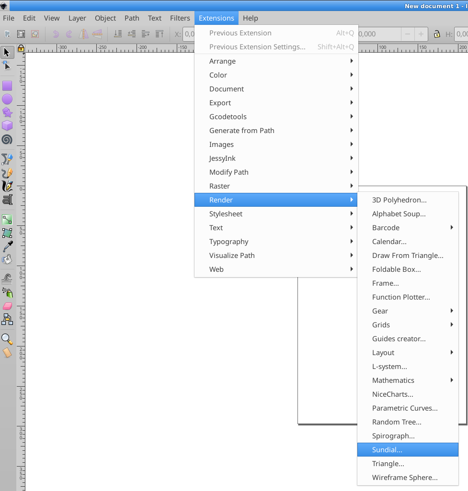

# SUNDIAL
This is an Inkscape extension.

To install it, download `sundial.py` and `sundial.inx`. Copy the files into the directory listed at `Edit > Preferences > System: User extensions`. After a restart of Inkscape, the new extension will be available.

To generate your own sundial, please
* go to https://www.sunearthtools.com/dp/tools/pos_sun.php
* select your location
* _execute_ the calculation
* scroll down to "Annual sun path"
* "download CSV"

Finally provide the CSV to the extention:

